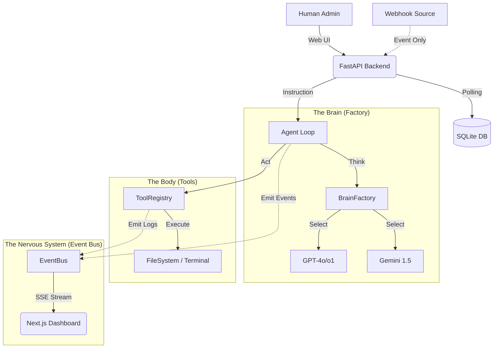

# OSIRIS: Omni-Channel Dev Orchestrator

> **Plataforma Enterprise de Orquestación de Desarrollo Asistido por IA con Supervisión Humana (HITL)**

   

---

## 📖 Tabla de Contenidos

1.  [Introducción y Visión](#-introducción-y-visión)
2.  [Novedades Fase 2: Event-Driven Intelligence](#-novedades-fase-2-event-driven-intelligence)
3.  [Arquitectura del Sistema](#-arquitectura-del-sistema)
4.  [Componentes Clave Exhaustivos](#-componentes-clave-exhaustivos)
5.  [Limitaciones y Gaps Conocidos](#-limitaciones-y-gaps-conocidos)
6.  [Instalación y Configuración](#-instalación-y-configuración)
7.  [Guía de Uso](#-guía-de-uso)

---

## 🔭 Introducción y Visión

**OSIRIS** es un sistema nervioso digital para el desarrollo de software. No es solo un chatbot; es un **Orquestador Omni-Canal**.
Permite ingestar tareas desde múltiples fuentes (Web, Webhooks), asignarlas a "Cerebros" de IA intercambiables (OpenAI, Gemini), y visualizar su proceso de pensamiento y ejecución en tiempo real.

---

## 🚀 Novedades Fase 2: Event-Driven Intelligence

La versión 2.1 transforma a OSIRIS en un organismo vivo:

*   **⚡ Arquitectura Reactiva (SSE)**: El backend "empuja" pensamientos, logs y código en tiempo real vía Server-Sent Events (`event_bus`).
    *   *Nota*: Incluye polling automático (2s) como mecanismo de robustez (failsafe).
*   **🧠 Multi-Brain Hybrid Engine**: Soporte ampliado para razonamiento avanzado.
    *   **OpenAI**: `gpt-4o`, `gpt-4-turbo`, `o1-preview`, `o1-mini`.
    *   **Gemini**: `gemini-1.5-pro`, `gemini-1.5-flash`.
*   **👁 Observabilidad Extrema**: 
    *   "Terminal Feed" estilo Matrix.
    *   "Artifact Viewer" para código.
    *   **Visual Debugger**: Herramienta de desarrollador integrada en UI para inspeccionar payloads crudos.

---

## 🏗 Arquitectura del Sistema

### Diagrama de Flujo de Datos


---

## 🧩 Componentes Clave Exhaustivos

### 1. El Backend (`/backend`)

**Estructura de Directorios Auditada:**
*   `app/core`: Configuración (`config.py`), Autenticación (`auth.py`, `security.py`) y **EventBus** (`event_bus.py`).
*   `app/api`:
    *   `endpoints/messages.py`: Endpoint crítico de chat con serialización forzada a String (fix v2.1).
    *   `endpoints/agent_runner.py`: Trigger asíncrono que instancia `AgentService`.
    *   `endpoints/webhooks.py`: Ingesta de eventos externos (Ver limitaciones).
*   `app/services`:
    *   `agent_service.py`: Lógica de negocio principal. Inyecta contexto de OS (Windows/Linux) al prompt.
    *   `brain/`: Implementaciones de `OpenAIBrain` (soporte o1 nativo) y `GeminiBrain`.
    *   `tools/`: Registro central de capacidades del agente.
*   `app/models`: `Task`, `Message`, `User` (SQLAlchemy).

### 2. El Frontend (`/frontend`) (Next.js 16 + Tailwind)

**Stack & Flow:**
*   `useEventStream.ts`: Maneja la conexión SSE.
*   `useTaskWebSocket.ts`: (Legacy) Mantenido para input de chat de usuario.
*   `/tasks/[id]/page.tsx`:
    *   **ChatInterface**: Renderiza mensajes.
    *   **Visual Debugger**: Componente `<details>` abajo a la izquierda para inspección de JSON crudo (útil para verificar `sender_type`).

---

## 🚧 Limitaciones y Gaps Conocidos (Audit v2.1)

1.  **Webhooks (Omni-Channel)**: El endpoint `/ingest/{source}` recibe datos y emite eventos al bus, pero **NO crea Tareas persistentes** en la base de datos automáticamente. Es funcional para alertas volátiles, pero no para workflow completo "Start-from-WhatsApp".
2.  **Persistencia de Artefactos**: Los archivos generados se guardan en disco local. El Frontend los visualiza en tiempo real, pero no existe una tabla `Artifact` en la Base de Datos. Si se reinicia el servidor, el historial de "qué archivos se tocaron" desaparece de la UI (aunque los archivos persisten en disco).
3.  **Logs de Debug**: Se recomienda usar la herramienta "Visual Debugger" en el frontend si los mensajes del agente parecen invisibles, para descartar problemas de serialización.

---

## ⚙ Instalación y Configuración

### Prerrequisitos
*   Python 3.11+
*   Node.js 18+
*   Claves de API: `OPENAI_API_KEY` y/o `GEMINI_API_KEY`.

### 1. Backend Setup
```powershell
cd backend
python -m venv venv
.\venv\Scripts\Activate
pip install -r requirements.txt
pip install openai google-generativeai # Deps Fase 2

# Configurar .env (Copiar de .env.example)
# Asegurar DATABASE_URL apunta a SQLite local
```

### 2. Frontend Setup
```powershell
cd frontend
npm install
npm run dev
# Corre en localhost:3000
```

### 3. Inyección y Admin
```powershell
$env:PYTHONPATH="backend"
python scripts/seed_admin.py # Crea admin@osiris.dev
python scripts/inject_task.py # Crea tarea base
```

---

## 🎮 Guía de Uso

1.  **Login**: `admin@osiris.dev` / `admin123`.
2.  **Agente**: En `/tasks/[id]`, selecciona un modelo (ej: `o1-mini` para velocidad) y pulsa "Auto-Run Agent".
3.  **Chat**: Si el agente responde, el mensaje debe aparecer en segundos (vía SSE o Polling).
4.  **Debug**: Si dudas, abre el "Show Raw Debug Data" en la esquina inferior izquierda.

---
**© 2025 Osiris Project** | *Building the Future of Autonomous Coding*
