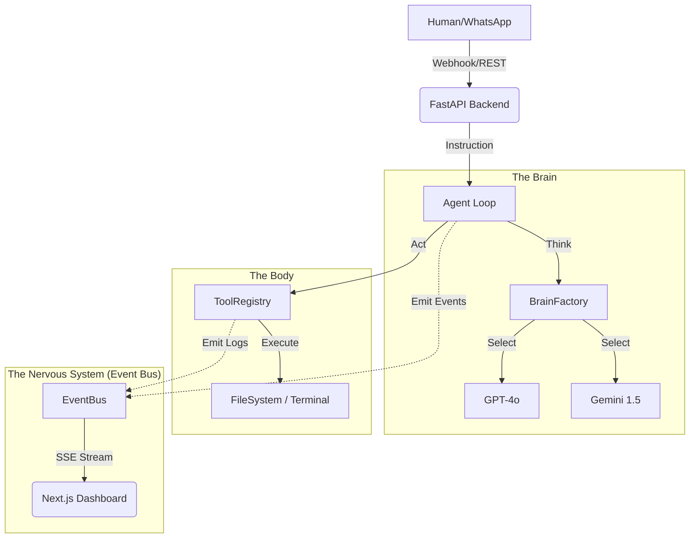

# OSIRIS: Omni-Channel Dev Orchestrator

> **Plataforma Enterprise de Orquestación de Desarrollo Asistido por IA con Supervisión Humana (HITL)**

   

---

## 📖 Tabla de Contenidos

1.  [Introducción y Visión](#-introducción-y-visión)
2.  [Novedades Fase 2: Event-Driven Intelligence](#-novedades-fase-2-event-driven-intelligence)
3.  [Arquitectura del Sistema](#-arquitectura-del-sistema)
4.  [Componentes Clave](#-componentes-clave)
5.  [Instalación y Configuración](#-instalación-y-configuración)
6.  [Guía de Uso](#-guía-de-uso)

---

## 🔭 Introducción y Visión

**OSIRIS** es un sistema nervioso digital para el desarrollo de software. No es solo un chatbot; es un **Orquestador Omni-Canal**.
Permite ingestar tareas desde cualquier fuente (WhatsApp, Email, Jira), asignarlas a "Cerebros" de IA intercambiables (OpenAI, Gemini), y visualizar su proceso de pensamiento y ejecución en tiempo real, píxel a píxel.

El sistema garantiza que ningún artefacto (código, documentación) ingrese al repositorio sin una validación explícitamente autenticada y documentada por un supervisor humano calificado.

---

## 🚀 Novedades Fase 2: Event-Driven Intelligence

La versión 2.0 transforma a OSIRIS en un organismo vivo:

*   **⚡ Arquitectura Reactiva (SSE)**: El frontend ya no "pregunta" por cambios. El backend "empuja" cada pensamiento, log de terminal y caracter de código escrito en tiempo real vía Server-Sent Events.
*   **🧠 Multi-Brain Hybrid Engine**: Alterna dinámicamente entre **GPT-4o** (para razonamiento complejo) y **Gemini 1.5 Pro** (para contexto masivo) con un solo clic.
*   **👁 Observabilidad Extrema**: Nuevo panel "Terminal Feed" estilo Matrix y "Live Artifact Viewer" que muestra cómo el agente escribe código línea por línea.
*   **🔌 Omni-Channel Ingestion**: Webhooks preparados para recibir inputs externos (ej: mensajería instantánea) y convertirlos en tareas accionables instantáneamente.

---

## 🏗 Arquitectura del Sistema

### Diagrama de Flujo de Datos


---

## 🧩 Componentes Clave

### 1. El Backend (`/backend`)
*   **FastAPI**: Motor de alta velocidad.
*   **Event Bus**: Sistema Pub/Sub asíncrono para distribuir eventos (`app/core/event_bus.py`).
*   **Brain Factory**: Patrón de diseño para instanciar proveedores de IA agnósticos.
*   **Agent Service**: El bucle infinito de "Percibir -> Pensar -> Actuar".

### 2. El Frontend (`/frontend`)
*   **Next.js 16 + Tailwind**: UI Moderna y Oscura.
*   **Hooks Inteligentes**:
    *   `useEventStream`: Mantiene la conexión SSE viva y reconecta automáticamente.
    *   `useTaskWebSocket`: (Legacy) Maneja el chat bidireccional de baja latencia.
*   **Widgets Vivos**:
    *   **TerminalFeed**: Scroll automático de logs.
    *   **ArtifactViewer**: Renderizado de código con syntax highlighting (simulado).

---

## ⚙ Instalación y Configuración

### Prerrequisitos
*   Python 3.11+
*   Node.js 18+
*   Claves de API: `OPENAI_API_KEY` y/o `GEMINI_API_KEY`.

### 1. Backend Setup
```powershell
# En /backend o root
python -m venv venv
.\venv\Scripts\Activate
pip install -r backend/requirements.txt
# Instalar nuevas deps de Fase 2
pip install openai google-generativeai

# Configurar .env
# Crear archivo .env en /backend con:
# DATABASE_URL=...
# SECRET_KEY=...
# OPENAI_API_KEY=sk-...
# GEMINI_API_KEY=AIza...
```

### 2. Frontend Setup
```powershell
cd frontend
npm install
npm run dev
```

### 3. Inyectar Datos Iniciales
```powershell
$env:PYTHONPATH="backend"
python scripts/seed_admin.py # Crea usuario admin
python scripts/inject_task.py # Crea tarea de prueba ID 2
```

---

## 🎮 Guía de Uso

1.  **Login**: Accede a `http://localhost:3000` con `admin@osiris.dev` / `admin123`.
2.  **Dashboard**: Verás las tareas. Haz clic en "Nueva Tarea de Prueba MCP".
3.  **Task Detail**:
    *   **Chat**: Puedes hablar con el historial.
    *   **Brain Selector**: Arriba a la izquierda, elige "OpenAI" o "Gemini".
    *   **Auto-Run**: Presiona el botón "Play".
        *   Observa el panel derecho ("Terminal") cobrar vida.
        *   Observa cómo aparecen archivos en el "Artifact Viewer".

### Simulación (Debugging)
Si no quieres gastar tokens de IA, puedes simular una ejecución compleja corriendo:
```powershell
python scripts/simulate_agent_flow.py
# Esto inyectará eventos falsos en el sistema que se visualizarán en el Frontend como si fueran reales.
```

---
**© 2025 Osiris Project** | *Building the Future of Autonomous Coding*
