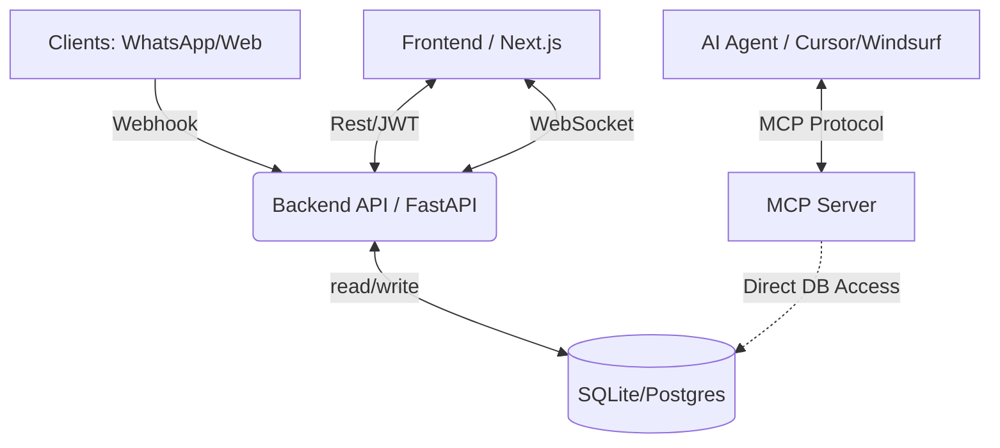

# OSIRIS: Omni-Channel Dev Orchestrator

> **Plataforma Enterprise de Orquestación de Desarrollo Asistido por IA con Supervisión Humana (HITL)**

    

---

## 📖 Tabla de Contenidos

1.  [Introducción y Filosofía](#-introducción-y-filosofía)
2.  [Seguridad y Autenticación (Multi-Auth)](#-seguridad-y-autenticación-multi-auth)
3.  [Arquitectura del Sistema](#-arquitectura-del-sistema)
4.  [Estructura del Proyecto](#-estructura-del-proyecto)
5.  [Capacidades y Casos de Uso](#-capacidades-y-casos-uso)
6.  [Modelo de Datos y Estados](#-modelo-de-datos-y-estados)
7.  [Model Context Protocol (MCP)](#-model-context-protocol-mcp)
8.  [Instalación y Despliegue](#-instalación-y-despliegue)
9.  [Guía de Desarrollo (Contributing)](#-guía-de-desarrollo-contributing)
10. [Troubleshooting](#-troubleshooting)

---

## 🔭 Introducción y Filosofía

**OSIRIS** es un **sistema inmunológico para el código generado por IA**. Introduce una capa de gobernanza estricta (HITL - Human In The Loop) entre la capacidad creativa de agentes de IA y la producción.

El sistema garantiza que ningún artefacto (código, documentación, refactoring) ingrese al repositorio sin una validación explícitamente autenticada y documentada por un supervisor humano calificado.

---

## 🔐 Seguridad y Autenticación (Multi-Auth)

En su versión 1.1.0, OSIRIS implementa un ecosistema de seguridad robusto para entornos corporativos:

### Características Principales:
*   **Identidad DUAL**: Soporta login mediante credenciales locales (Email/Password) y Single Sign-On (SSO) vía **Google OAuth2** (Real y Mock para desarrollo).
*   **JWT Protection**: Todos los endpoints críticos de tareas y artefactos están protegidos por tokens de sesión firmados (HS256).
*   **Role-Based Access (RBAC)**: Distinción entre `Admin`, `Supervisor` y `Agent`.
*   **Auth Guard Global**: Redirección automática a login para usuarios no autenticados.
*   **Secure Storage**: Hashing de contraseñas robusto con `PBCKDF2-SHA256` para máxima compatibilidad y seguridad.

---

## 🏗 Arquitectura del Sistema

### Diagrama de Componentes


1.  **Backend Core (`/backend`)**: API REST FastAPI + WebSockets Manager. Implementa lógica de validación de tokens y orquestación de mensajes.
2.  **Frontend Portal (`/frontend`)**: Next.js 16 App Router. Dashboard en tiempo real conectado vía WebSockets para actualizaciones instantáneas de estado.
3.  **MCP Server (`/mcp-server`)**: Puente que expone la base de datos como "Herramientas" para Agentes de IA remotos.

---

## 📂 Estructura del Proyecto

```text
OSIRIS/
├── backend/                # API Server (Python/FastAPI)
│   ├── app/
│   │   ├── api/            # REST Endpoints y WebSockets
│   │   ├── core/           # Security (JWT), Config, Auth helpers
│   │   ├── models/         # SQLAlchemy Models (User, Task, Artifact)
│   │   └── schemas/        # Pydantic Schemas (Validation)
│   └── alembic/            # DB Migrations
├── frontend/               # User Interface (Next.js/TS)
│   ├── src/
│   │   ├── app/            # Pages (login, dashboard, tasks/[id])
│   │   ├── components/     # UI (AuthGuard, Providers, ArtifactViewer)
│   │   ├── hooks/          # useAuth, useTaskWebSocket
│   │   └── lib/            # api.ts (fetchWithAuth helper)
├── mcp-server/             # AI Integration Layer (server.py)
├── scripts/                # Utility scripts (seed_admin, test_mcp_real)
└── docker-compose.yml      # Orchestration
```

---

## ⚡ Capacidades y Casos de Uso

1.  **Generación de Features**: Inicia una tarea desde un Webhook; el agente la reclama, genera el código y tú lo apruebas en el dashboard.
2.  **Dashboard en Tiempo Real**: Verificación visual instantánea de los cambios de estado (Pending -> Claimed -> Done) sin recargar la página.
3.  **Gestión de Credenciales**: Manejo seguro de secretos con `.env` ignorados por Git y variables públicas para frontend.

---

##  Instalación y Despliegue (Windows 11)

### Despliegue Local (Desarrollo)

**1. Preparar el Entorno (Backend):**
```powershell
# Desde el root
python -m venv venv
.\venv\Scripts\Activate
pip install -r backend/requirements.txt
```

**2. Inyectar Administrador Inicial:**
Indispensable para el primer acceso al sistema:
```powershell
$env:PYTHONPATH="backend"
python scripts/seed_admin.py
# Credenciales generadas: admin@osiris.dev / admin123
```

**3. Preparar el Frontend:**
```powershell
cd frontend
npm install
npm run dev
```

### Testing y Validación

*   **Inyectar Tarea de Prueba**: `python scripts/inject_task.py`
*   **Validar Lógica MCP (Real)**: `python scripts/test_mcp_real.py` (Conecta a DB real y actualiza estado)

---

## 🛠 Guía de Desarrollo (Contributing)

### Backend
*   **Auth**: Siempre usa la dependencia `Depends(deps.get_current_user)` en nuevos endpoints.
*   **DB**: Usa sesiones asíncronas (`AsyncSession`).

### Frontend
*   **API**: Realiza peticiones usando `fetchWithAuth(endpoint)` para inyectar automáticamente el JWT.
*   **Estética**: Mantener el modo oscuro premium configurado en `globals.css`.

---

## 🔧 Troubleshooting

*   **Error "Failed to fetch" en Login**: Puede deberse a incompatibilidad de `bcrypt`. El sistema ya utiliza `pbkdf2_sha256` para evitar crashes en Windows.
*   **Google Login**: Si no tienes credenciales reales configuradas, usa el botón "Dev Mode" o configura `NEXT_PUBLIC_GOOGLE_CLIENT_ID` en `frontend/.env.local`.
*   **WebSockets**: Si el estado no se actualiza, revisa la consola del navegador para ver logs de conexión (`ws://localhost:8000/api/v1/ws/...`).

---
**© 2025 Osiris Project** | *Secure Orchestration for the AI Era*
